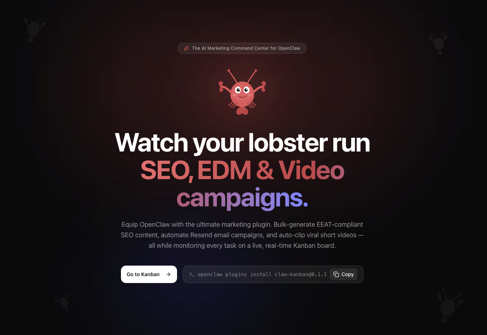

# 🦞 Claw Kanban

<div align="center">
  <h3>The AI Marketing & Video Command Center for OpenClaw</h3>
  <p>Watch your lobster run SEO campaigns, send emails, and clip videos — while you monitor everything on a live Kanban board.</p>

  [](https://www.npmjs.com/package/claw-kanban)
  [](https://opensource.org/licenses/MIT)
  [](https://openclaw.ai)
</div>

---

Equip your OpenClaw agent with the ultimate productivity plugin. Bulk-generate EEAT-compliant SEO content, automate Resend email campaigns, process videos into short clips — all while monitoring every task on a live, real-time Kanban board.



## ✨ Core Pillars

### 1. The Core Engine: A Visual Kanban Board
Before executing massive campaigns, you need observability. As your OpenClaw agent writes articles, sends emails, or clips videos, it updates this Kanban board in real-time.
- Track subtasks
- Read detailed progress logs
- Download generated artifacts (Markdown/HTML files, video clips) directly from the cloud dashboard.

### 2. Pillar 1: SEO Engine (From sitemap to published content)
Equip your agent with expert SEO skills. It can analyze your sitemap to find content gaps, perform SERP competitor analysis, and bulk-generate high-quality, EEAT-compliant markdown articles ready for your blog.
- **Sitemap Gap Analyzer**: Crawls your existing content to find high-ROI keywords you are missing.
- **Competitor Intel**: Analyzes SERP rivals and reverse-engineers their content structures.
- **EEAT Content**: Generates deep, factual articles with proper LSI keywords and metadata.
- **On-Page Audits**: Scans your live URLs and provides actionable checklists to improve ranking.

### 3. Pillar 2: EDM Engine (Automated Email Marketing)
Connect your Resend API key and your lobster transforms into a full-stack email marketer.
- **AI Email Design**: Auto-generates responsive, inline-CSS HTML emails matching your brand.
- **Local CRM Sync**: Maintains `audience.json` locally to track who was emailed and who bounced.
- **Live Tracking**: Polls Resend to show open rates and delivery stats right on the task card.

### 4. Pillar 3: Video Clip Engine (Upload → Transcribe → AI Split)
Turn long videos into short, topic-based clips — fully automated.
- **One-command processing**: Upload a video, transcribe audio, AI-analyze for topic boundaries, and split into clips.
- **Cloud-synced**: All projects, transcripts, and clips are stored in the cloud and visible on the web dashboard.
- **CLI + Agent**: Process videos via `claw-kanban video process` or let the agent handle it conversationally.

---

## 🚀 Installation

**One command.** Your lobster gets the `claw-kanban` plugin and can start syncing tasks.

```bash
openclaw plugins install claw-kanban
```

*(Note: Requires Node.js 22+ and an active OpenClaw setup)*

## ⚙️ Quick Start & Configuration

1. **Log in with Google:** Visit our cloud dashboard at **[www.teammate.work](https://www.teammate.work)** and sign in.
2. **Get your API key:** Click 'Get your keys' in the dashboard. Copy the key (starts with `ck_sk_`).
3. **Give the key to your lobster:** You can configure the API Key by telling your agent:
   > "Please save my Claw Kanban API Key: `ck_sk_...`"

Or, manually add it to your `~/.openclaw/openclaw.json` (or `~/.claw-kanban/config.json`):

```json
{
  "plugins": {
    "entries": {
      "claw-kanban": {
        "enabled": true,
        "config": {
          "apiKey": "ck_sk_your_key_here",
          "resendApiKey": "re_your_resend_key_here"
        }
      }
    }
  }
}
```

*Don't forget to restart your OpenClaw gateway (`openclaw gateway restart`) after manually changing configurations.*

## 🗣️ Just talk to your lobster.

No complex UI to learn. Just tell OpenClaw what you want to achieve, and the plugin automatically manages the workflow on your Kanban board.

**SEO Example:**
> "Read my sitemap at https://example.com/sitemap.xml and find 5 high-ROI keyword gaps. Write an EEAT-compliant article for the best one."

**EDM Example:**
> "Design a launch email for our new 'Pro Plan' using our brand colors. Send it to the audience list in my local folder."

**Video Clip Example:**
> "Help me clip /Users/me/Downloads/meeting.mp4 into short segments. Keywords: product launch, pricing strategy."


## 🎬 Video CLI

You can also process videos directly from the command line:

```bash
claw-kanban video process ./meeting.mp4 --keywords "product launch" --output ./clips/
claw-kanban video list
claw-kanban video detail <projectId>
claw-kanban video download <projectId> --output ./clips/
claw-kanban video delete <projectId>
```

## 💖 Acknowledgements & Credits

This plugin integrates and builds upon the excellent [SEO & GEO Skills Library](https://github.com/aaron-he-zhu/seo-geo-claude-skills) by Aaron Zhu. We have incorporated several of their powerful SEO skills directly into Claw Kanban to provide a complete, closed-loop SEO workflow. We've also included a custom `markdown-to-html` skill to seamlessly turn those SEO Markdown drafts into publish-ready webpages.

We extend our gratitude to the original author for open-sourcing these high-quality skills under MIT. Our plugin merges these capabilities with a visual task management board to track the agent's progress as it executes these SEO workflows.

## 📜 License

This project is licensed under the **MIT License**. See the [LICENSE](LICENSE) file for details.

---
*Built for OpenClaw. Not affiliated or endorsed by the official OpenClaw team.*
